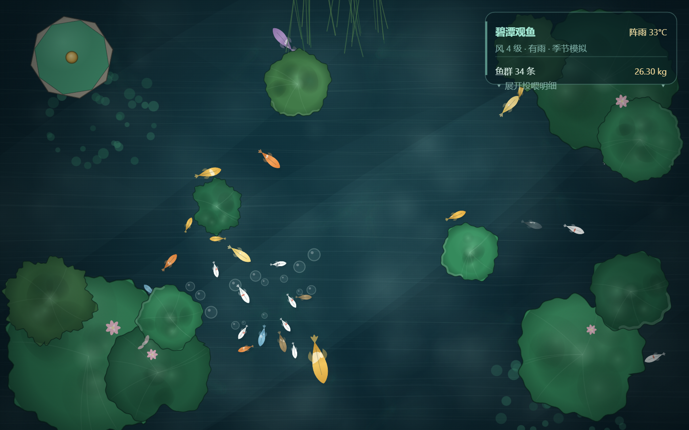

# 摸鱼 · 碧潭观鱼

一个**俯视锦鲤池桌面应用**：整池锦鲤游在你的**桌面背景层**（图标下面），
鼠标点击桌面即可投食，鱼群会游过来抢食。

灵感来自武汉东湖听涛景区「碧潭观鱼」——水清见底、锦鲤成群。



## 特性

**画面**

- 纯 Canvas 2D 程序化绘制，**零美术素材依赖**，全部由代码生成
- 12 个锦鲤/金鱼品系（红白、昭和、大正、黄金、茶鲤、浅黄、白写、绯红、九纹龙、贴分、黑纹龙、茶金）
- 淡彩插画风：柔光晕 + 细墨线 + 水彩斑块
- 水体：深度渐变 + 阳光光柱 + 表面波纹 + 浑浊感
- 荷叶 5 种形态 × 4 种色调随机组合，另有荷花、浮萍、睡莲、芦苇、沉船木
- 昼夜自动切换（19:00–6:00 转夜景，含萤火虫与月光）

**交互**

- **左键单击** = 投食：一圈正圆涟漪 + 3~5 粒鱼食缓慢下沉
- **左键双击** = 大量投食 + 附近鱼群**冲刺**抢食
- 鱼只在真正靠近时才吃到，吃完有啄食冷却
- **右上角透明面板**：本地天气 + 鱼群总数 + 总重量
  - 点面板展开：各品种的条数 / 重量 / 吃食进度条
- **右键** = 显示 / 隐藏面板

**行为**

- 每帧分离力，鱼不会叠在一起
- 速度差异化：小鱼快、大鱼慢，同尺寸也各有个体差异
- 摆尾动画按「品种 × 体长档」成组共享资源

## 运行

### 方式一：直接下载构建产物

去 Releases 下载，解压双击 `BitanPond.exe`。

### 方式二：自己构建

需要 **64 位 Windows**，其它什么都不用装
（用系统自带的 .NET Framework csc，不需要 Visual Studio 或 dotnet SDK）。

```bat
build.cmd
```

脚本会自动：

1. 从 NuGet 下载 WebView2 SDK
2. 编译宿主程序
3. 组装到 `build\run\`

然后双击 `build\run\BitanPond.exe`。

> 首次运行需要系统已安装 **WebView2 Runtime**。
> Windows 11 自带；Windows 10 可从微软官网免费下载。

## 退出

程序没有窗口和托盘图标，挂在桌面背景层。
退出方式：任务管理器结束 `BitanPond.exe`。

## 技术要点

**为什么要用 WebView2 + 全局鼠标钩子？**

窗口挂在桌面壁纸层（`Progman` 下的 `WorkerW`）后，
会被桌面图标层完全盖住，**收不到任何鼠标事件**。
所以宿主用 `WH_MOUSE_LL` 全局钩子捕获鼠标，再通过
`PostWebMessageAsJson` 转发给页面。

**为什么必须关掉 GPU 合成？**

WebView2 默认走 D3D 独立合成器，挂到 `WorkerW` 下画不出来。
加 `--disable-gpu-compositing` 后走 GDI 层才可见——但代价是
**软件合成**，性能大幅下降。

**性能优化（关键）**

| 做法 | 效果 |
|---|---|
| 鱼从「每帧重绘矢量路径」改成**预烘精灵** | 1.4 → 60 FPS（42 倍） |
| 身体 / 尾鳍**拆成两张精灵**，尾鳍连续旋转 | 精灵数 368 → 46，显存 23.6MB → 1.2MB |
| 按「品种 × 体长档」**成组共享**摆动资源 | 150 条鱼只需 54 组，省 1.9 倍 |
| 静态图层（池底 / 水面 / 岸上）预渲染到离屏 canvas | 每帧只 `drawImage` |
| 画布 dpr 限制为 1 | 软件合成下 2x = 4 倍像素，纯亏 |

实测：2880×1800 软件合成下稳定 **59~60 FPS**。

## 文件结构

```
src/
  art.js        绘制库：鱼体/鱼鳍/尾鳍、荷叶、荷花、水草、凉亭、涟漪、水体
  scene.js      场景：鱼群构建、运动与分离、分层合成、渲染主循环
  pond.js       玩法：投食、鱼食下沉、进食冷却、天气、右上角信息面板
  index.html    页面：主循环、交互绑定、接收宿主转发的鼠标消息
  PondHost.cs   宿主：挂载到桌面壁纸层 + 全局鼠标钩子
build.cmd       一键构建
docs/           截图
```

## 已知限制

- 软件合成是性能瓶颈，无法再往上提（画布分辨率影响很小，瓶颈在合成器搬运）
- 目前只有 Windows 实现（依赖 `WorkerW` 与 `WH_MOUSE_LL`）
- 天气是**离线季节模拟**，不联网。真实天气需要自己申请和风/高德 API key

## License

MIT
